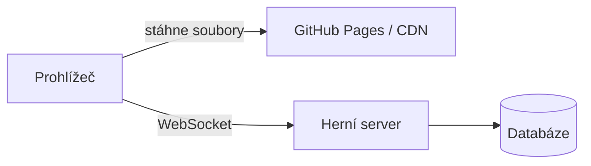
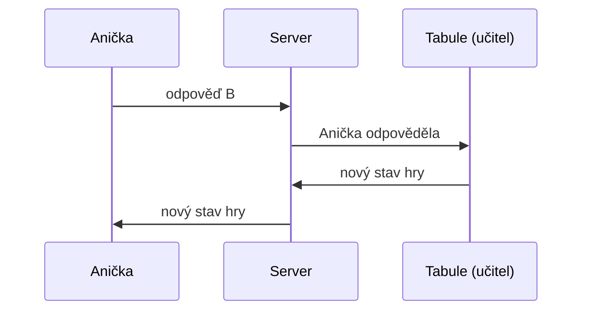

# Jak funguje webová aplikace

Poznámky k workshopu – od statické stránky k multiplayerové hře. Ukázka formátu OQSE Markdown: diagramy, vzorce a skryté odpovědi bez escapování.

## Základy

### Statická stránka vs. aplikace
<!-- oqse: {id: 0192f0c4-a004-7000-8000-000000000001, tags: [web]} -->
**Statická stránka** jsou hotové soubory (HTML, CSS, JS), které server jen pošle. **Aplikace** navíc něco počítá, ukládá nebo propojuje lidi – potřebuje server, databázi nebo spojení v reálném čase.



> [!hidden]-
> GitHub Pages zvládne jen levou část diagramu. Pro multiplayer potřebuješ i server vpravo.

### Klient a server
<!-- oqse: {id: 0192f0c4-a004-7000-8000-000000000002, tags: [web]} -->
Klient (prohlížeč) posílá požadavky, server odpovídá. U multiplayeru drží server otevřené spojení se všemi hráči:



#### Kdo rozhoduje?
Stav hry drží jedno místo – **authority**. Ostatní posílají jen akce („odpověděl jsem B“) a dostávají výsledek.

## Spolupráce s AI

### Git jako záchranná síť
<!-- oqse: {id: 0192f0c4-a004-7000-8000-000000000003, tags: [git, ai]} -->
AI občas opraví jednu věc a rozbije tři další. Git si pamatuje každou verzi:

```bash
git add .
git commit -m "Funkční verze před další změnou od AI"
# AI něco rozbila? Zpátky k poslednímu commitu:
git restore .
```

> [!hidden]-
> Zlaté pravidlo: **commit před každou větší změnou**. Pokus se nepovede → jeden příkaz a jsi zpátky.

### Jak psát prompty
<!-- oqse: {id: 0192f0c4-a004-7000-8000-000000000004, tags: [ai]} -->
1. **Jasné zadání** – co přesně má vzniknout a pro koho.
2. **Kontext** – dokumentace, ukázky, existující kód.
3. **Omezení** – co se nesmí (např. žádné `localStorage`).
4. **Malé kroky** – po každém kroku zkontroluj výsledek.

> [!hidden]-
> Špatně: „Udělej hru.“ Dobře: „Udělej kvíz pro třídu podle přiloženého návodu, otázky typu mcq-single, 20 s na otázku, rychlejší správná odpověď = víc bodů.“

## Trocha matematiky

### Proč záleží na vzdálenosti serveru
<!-- oqse: {id: 0192f0c4-a004-7000-8000-000000000005, tags: [síť]} -->
Signál se v optickém kabelu šíří rychlostí asi $v \approx 200\,000\ \text{km/s}$. Doba cesty tam a zpět (ping) je nejméně

$$
t = \frac{2d}{v}
$$

kde $d$ je vzdálenost k serveru.

> [!hidden]-
> Server v USA ($d \approx 7\,000$ km): $t = \frac{2 \cdot 7\,000}{200\,000} = 0{,}07$ s = **70 ms**. Server v Praze ($d \approx 50$ km): pod **1 ms**. Proto CDN posílá soubory z nejbližšího místa.
